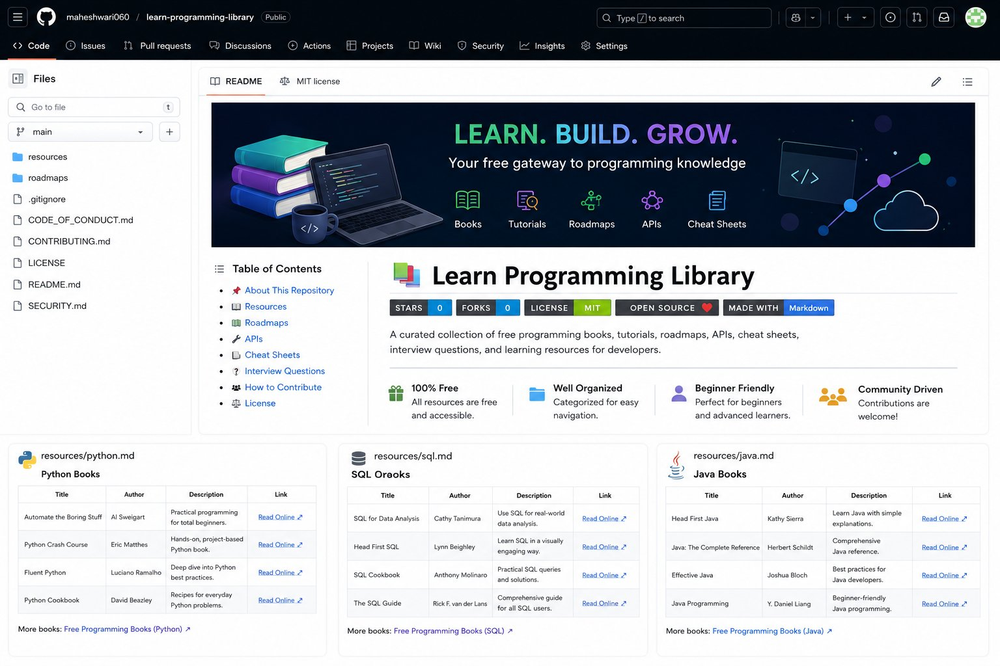

  

<h1 align="center">📚 Learn Programming Library</h1>

  
  
  
  

A curated collection of free programming books, tutorials, roadmaps, APIs, cheat sheets, interview questions, and learning resources for developers.

---

## 📑 Table of Contents

- [📖 About](#-learn-programming-library)
- [📚 Resources](#-resources)
- [🛣️ Roadmaps](#️-roadmaps)
- [🤝 Contributing](#-contributing)
- [📜 License](#-license)
- [⭐ Support](#-support)

---

## ✨ Features

- 📚 Curated programming learning resources
- 🛣️ Step-by-step technology roadmaps
- 🎥 Free courses and tutorials
- 📖 Programming books and documentation
- 💻 Practice platforms for coding
- 🌐 Official references and guides
- 🚀 Beginner to advanced learning paths

---

## 📊 Repository Stats

| Category | Count |
|----------|------:|
| 📚 Learning Resources | 12+ |
| 🛣️ Learning Roadmaps | 5+ |
| 💻 Programming Languages | 10+ |
| 🌍 Free Learning Materials | 100+ |

---

## 🚀 Quick Start

1. Browse the **Resources** section.
2. Choose a technology.
3. Follow the corresponding **Roadmap**.
4. Practice using the recommended platforms.
5. Build projects and keep learning!

---

## 🛠️ Tech Stack

- Python
- SQL
- Java
- JavaScript
- C
- C++
- Git & GitHub
- Linux
- Data Science
- Machine Learning
- Artificial Intelligence
- Cloud Computing

---
# 📚 Resources

| Topic | Link |
|--------|------|
| 🐍 Python | [Open](resources/python.md) |
| 🗄️ SQL | [Open](resources/sql.md) |
| ☕ Java | [Open](resources/java.md) |
| 🌐 JavaScript | [Open](resources/javascript.md) |
| 🌿 Git | [Open](resources/git.md) |
| 🐧 Linux | [Open](resources/linux.md) |
| 💻 C | [Open](resources/c.md) |
| 🚀 C++ | [Open](resources/cpp.md) |
| 📊 Data Science | [Open](resources/data-science.md) |
| 🤖 Machine Learning | [Open](resources/machine-learning.md) |
| 🧠 Artificial Intelligence | [Open](resources/artificial-intelligence.md) |
| ☁️ Cloud Computing | [Open](resources/cloud-computing.md) |

---

# 🛣️ Roadmaps

| Roadmap | Link |
|----------|------|
| 🐍 Python | [View](roadmaps/python-roadmap.md) |
| 📊 Data Analyst | [View](roadmaps/data-analyst-roadmap.md) |
| 🤖 Machine Learning | [View](roadmaps/machine-learning-roadmap.md) |
| 🧠 Artificial Intelligence | [View](roadmaps/ai-roadmap.md) |
| ☁️ Cloud Computing | [View](roadmaps/cloud-roadmap.md) |

---

## 🎯 Who is this repository for?

This repository is suitable for:

- 👨‍🎓 Students
- 💼 Job Seekers
- 👩‍💻 Software Developers
- 📊 Data Analysts
- 🤖 AI & ML Enthusiasts
- 🌐 Open Source Contributors

---

# 🤝 Contributing

Contributions are welcome!

If you know any useful learning resources, feel free to open a Pull Request.

---

# 📜 License

This project is licensed under the MIT License.

---

## ⭐ Support

If you found this repository useful, please consider giving it a ⭐ on GitHub.

Happy Learning! 🚀

---

Made with ❤️ by <strong>Naga Maheshwari Baluguri</strong>  

<a href="https://github.com/maheshwari060">
GitHub Profile
</a>

  

⭐ If you found this repository useful, please consider giving it a star!

